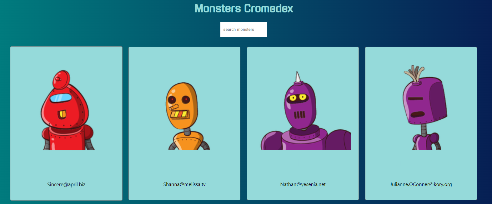

# Monsters Cromedex
The monster finder!

## Description

This is a simple project using react and [robo hash](https://robohash.org) API.
Implements a real time finder as well

## Usage

1. Install the dependencies with

`yarn install`

2. Run the code with

`yarn start`

3. Have fun!

